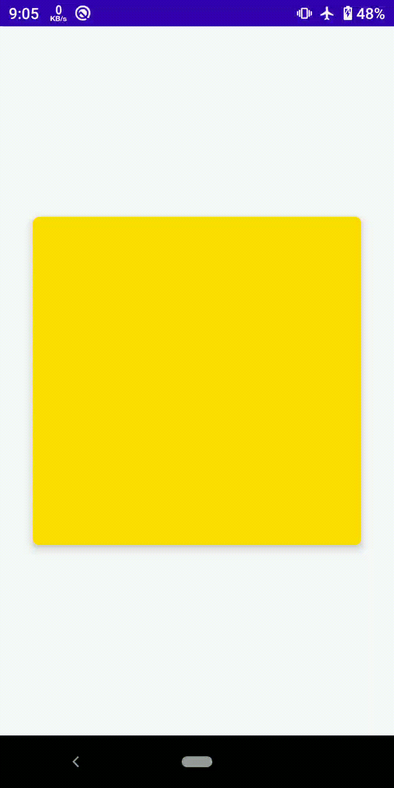

# ScratchCardView

[](https://www.apache.org/licenses/LICENSE-2.0)

<p align="center">

A lightweight Android scratch card view. 



</p>


## Using in your projects

### Gradle

Add the ScratchCardView library dependency in your **app module's** `build.gradle`:

```groovy
dependencies {
    implementation 'com.stackhour.lib:libScratchView:1.1.0'
}
```


Make sure that you have `jcenter()` in the list of repositories in your **project level** `build.gradle`:

```
repository {
    jcenter()
}
```
